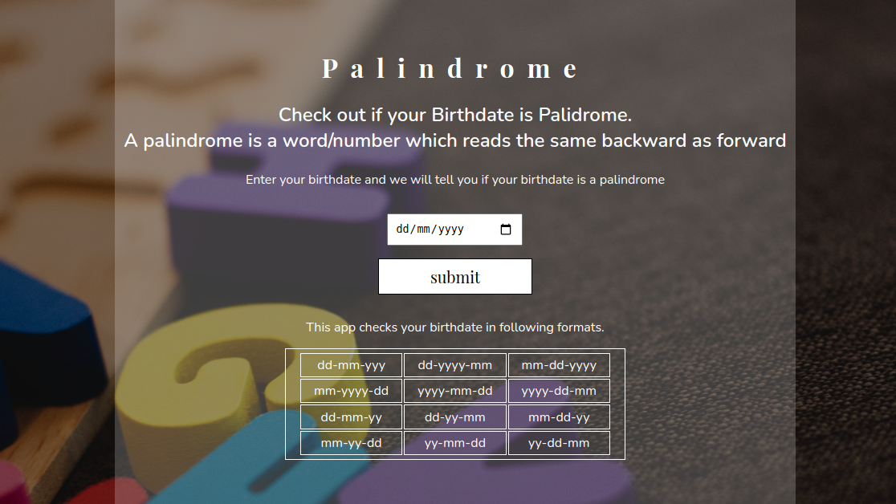

# neoG - Mark-13 Palindrome Birthday

This is a solution to the [Mark-13 of neoG camp](https://neog.camp/guide/mark-13).

## Table of contents

- [Overview](#overview)
  - [The challenge](#the-challenge)
  - [Screenshot](#screenshot)
  - [Links](#links)

## Overview
- Check if your birthday is a palindrome or not.

### The challenge

- Ask the user to input his/her birth date
- Check if the entered birthdate is a palindrome, if yes, show a message
- If the entered birthdate is not a palindrome:
- Find the nearest palindrome date
- Find how many days they missed

### Screenshot

### Links

[- Live Site URL](https://git-0r.github.io/mark13_palindrome/)
